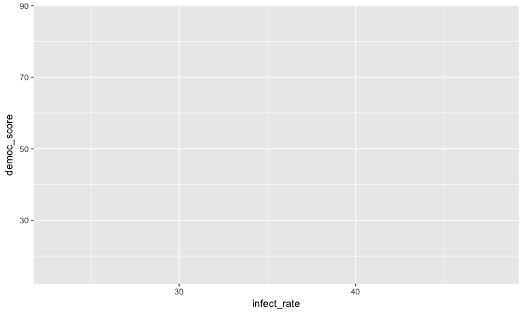
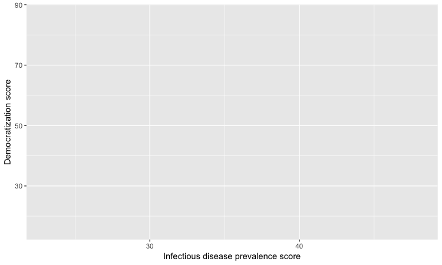
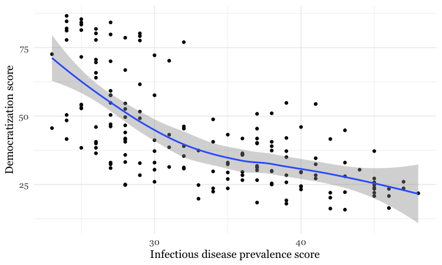
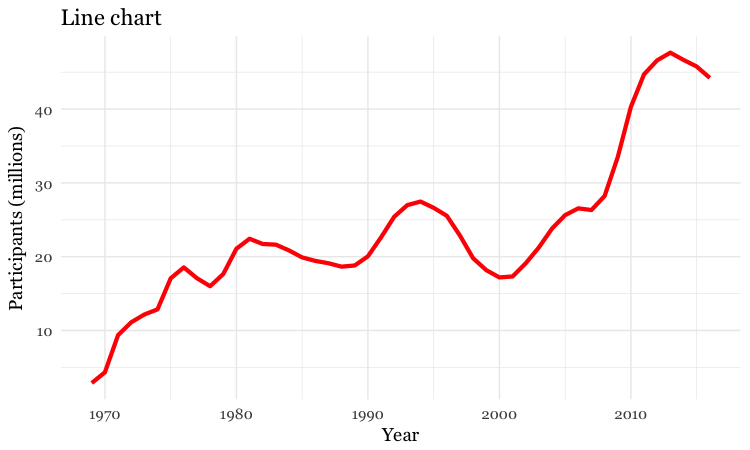
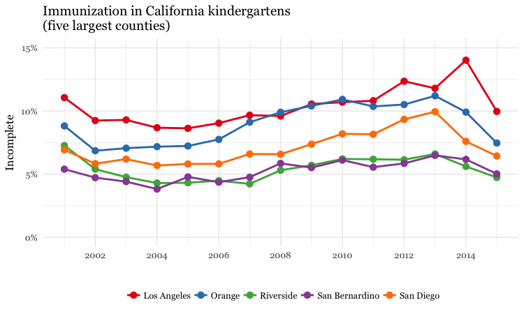
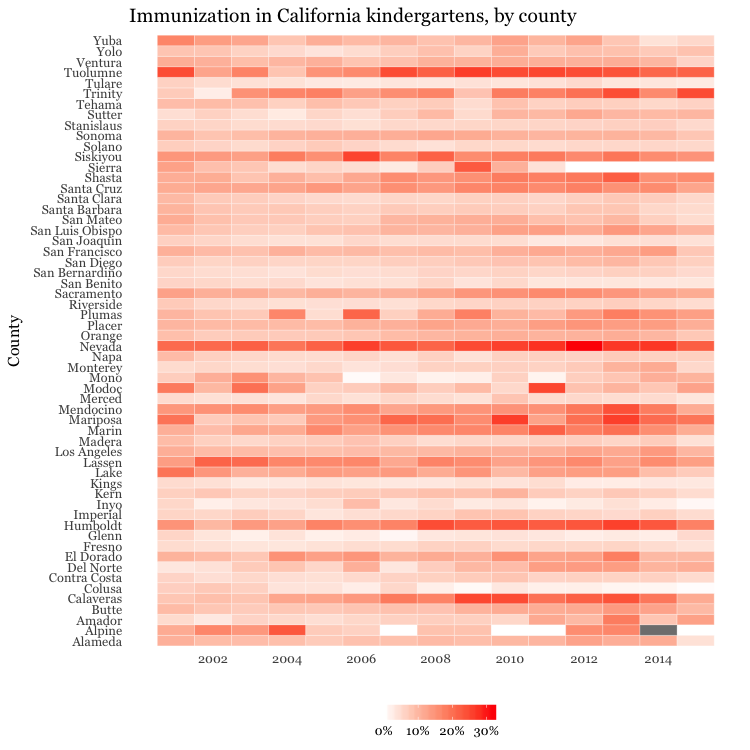

# Data analysis with R

### Introducing R and RStudio

In today's class we will analyze data using **[R](http://www.r-project.org/)**, which is a very powerful tool, designed by statisticians for data analysis. Described on its website as "free software environment for statistical computing and graphics," R is a programming language that opens a world of possibilities for making graphics and analyzing and processing data. Indeed, just about anything you may want to do with data can be done with R, from web scraping to making interactive graphics.

Our goal is to get used to working with data in R. In particular, we will learn how to run **[SQL](https://en.wikipedia.org/wiki/SQL)**-like analysis in R using the **[dplyr](https://cran.rstudio.com/web/packages/dplyr/vignettes/introduction.html)** package.

We will also make some graphics with R using the [**ggplot2**](http://ggplot2.tidyverse.org/reference/) package.

**[RStudio](https://www.rstudio.com/)** is an "integrated development environment," or IDE, for R that provides a user-friendly interface.

Launch RStudio, and the screen should look like this:


The main panel to the left is the R Console. Type valid R code into here, hit `return`, and it will be run. See what happens if you run:

```R
print("Hello World!")
```
### Software installation

Download R for your operating system by following the links from [here](https://cran.rstudio.com/). On the Mac, you need to download and install `R-3.4.2.pkg`.

Download the latest **free** version of RStudio Desktop [from here](http://www.rstudio.com/products/rstudio/download/).

Mac users may also to alter their Mac security preferences to allow apps authored by developers that are not part of Apple's ecosystem. Open `System Preferences>Security & Privacy`, select the `General` tab and click the lock icon at bottom left to make changes, then allow apps downloaded from `Anywhere`:


### The data we will use today

Download the data for this session from [here](wcsj-data.zip), unzip the folder and place it on your desktop. It contains the following files, the first two used in reporting [this story](https://www.newscientist.com/article/dn18806-revealed-pfizers-payments-to-censured-doctors/), which revealed that some of the doctors paid as "experts" by the drug company Pfizer had troubling disciplinary records:

- `pfizer.csv` Payments made by Pfizer to doctors across the United States in the second half on 2009. Contains the following variables:
 - `org_indiv` Full name of the doctor, or their organization.
 - `first_plus` Doctor's first and middle names.
 - `first_name` `last_name`. First and last names.
 - `city` `state` City and state.
 - `category of payment` Type of payment, which include `Expert-led Forums`, in which doctors lecture their peers on using Pfizer's drugs, and `Professional Advising.
 - `cash` Value of payments made in cash.
 - `other` Value of payments made in-kind, for example puschase of meals.
 - `total` value of payment, whether cash or in-kind.

- `fda.csv` Data on warning letters sent to doctors by the U.S. Food and Drug Administration, because of problems in the way in which they ran clinical trials testing experimental treatments. Contains the following variables:
 - `name_last` `name_first` `name_middle` Doctor's last, first, and middle names.
 - `issued` Date letter was sent.
 - `office` Office within the FDA that sent the letter.

- `disease_democ.csv` Data illustrating a controversial theory suggesting that the emergence of democratic political systems has depended largely on nations having low rates of infectious disease, from the [Global Infectious Diseases and Epidemiology Network](http://www.gideononline.com/) and *[Democratization: A Comparative Analysis of 170 Countries](http://www.amazon.com/Democratization-Comparative-Analysis-Countries-Routledge/dp/0415318602)*.

- `food_stamps.csv` [U.S. Department of Agriculture data](http://www.fns.usda.gov/pd/supplemental-nutrition-assistance-program-snap) on the number of `participants`, in millions, and `costs`, in $ billions, of the federal Supplemental Nutrition Assistance Program from 1969 to 2016.

- `kindergarten.csv` Data from the [California Department of Public Health](https://data.chhs.ca.gov/dataset/school-immunizations-in-kindergarten-by-academic-year), documenting enrollment and the number of children with complete immunizations at entry into kindergartens in California from 2001 to 2015. Contains the following variables:
  - `district` School district.
  - `sch_code` Unique identifying code for each school.
  - `pub_priv` Whether school is public or private.
  - `school` School name.
  - `enrollment` Number of children enrolled.
  - `complete` Number of children with complete immunizations.
  - `start_year` Year of entry (for the 2015-2016 school year, for example, this would be 2015).

- `nations.csv` Data from the [World Bank Indicators](http://data.worldbank.org/indicator/all) portal, which is an incredibly rich resource. Contains the following variables, from 1990 onwards:
 -  `iso2c` `iso3c` Two- and Three-letter [codes](http://www.nationsonline.org/oneworld/country_code_list.htm) for each country, assigned by the [International Organization for Standardization](http://www.iso.org/iso/home/store/catalogue_tc/catalogue_detail.htm?csnumber=63545).
 - `country` Country name.
 - `year`
 - `population` Estimated [total population](http://data.worldbank.org/indicator/SP.POP.TOTL) at mid-year, including all residents apart from refugees.
 - `gdp_percap` [Gross Domestic Product per capita](http://data.worldbank.org/indicator/NY.GDP.PCAP.PP.CD) in current international dollars, corrected for purchasing power in different territories.
 - `life_expect` [Life expectancy at birth](http://data.worldbank.org/indicator/SP.DYN.LE00.IN), in years.
 - `population` Estimated [total population](http://data.worldbank.org/indicator/SP.POP.TOTL) at mid-year, including all residents apart from refugees.
 - `birth_rate` [Live births during the year per 1,000 people](http://data.worldbank.org/indicator/SP.DYN.CBRT.IN), based on mid-year population estimate.
 - `neonat_mortal_rate` [Neonatal mortality rate](http://data.worldbank.org/indicator/SH.DYN.NMRT): babies dying before reaching 28 days of age, per 1,000 live births in a given year.
 - `region` `income` World Bank [regions and income groups](http://siteresources.worldbank.org/DATASTATISTICS/Resources/CLASS.XLS), explained [here](http://data.worldbank.org/about/country-and-lending-groups).

### Reproducibility: Save your scripts

Data journalism should ideally be fully documented and reproducible. R makes this easy, as every operation performed can be saved in a script, and repeated by running that script. Click on the  icon at top left and select `R Script`. A new panel should now open:


Any code we type in here can be run in the console. Hitting `Run` will run the line of code on which the cursor is sitting. To run multiple lines of code, highlight them and click `Run`.

Click on the save/disk icon in the script panel and save the blank script to the file on your desktop with the data for this workshop, calling it `wcsj.R`.

### Set your working directory

Now we can set the working directory to this folder by selecting from the top menu `Session>Set Working Directory>To Source File Location`. (Doing so means we can load the files in this directory without having to refer to the full path for their location, and anything we save will be written to this folder.)

Notice how this code appears in the console:

```R
setwd("~/Desktop/wcsj-data")
```

### Save your data

The panel at top right has two tabs, the first showing the `Environment`, or all of the "objects" loaded into memory for this R session. We can save this as well, so we don't have to load and process data again if we return to return to a project later.

(The second tab shows the `History` of the operations you have performed in RStudio.)

Click on the save/disk icon in the `Environment` panel to save and call the file `wcsj.RData`. You should see the following code appear in the Console:

```r
save.image("~/Desktop/wcsj-data/wcsj.RData")
```
Copy this code into your script, placing it at the end, with a comment, explaining what it does:

```r
# save session data
save.image("~/Desktop/wcsj-data/wcsj.RData")
```

### Comment your code

Anything that appears on a line after `#` will be treated as a comment, and will be ignored when the code is run. Get into the habit of commenting your code: Don't trust yourself to remember what it does!

### Some R code basics

- `<-` is known as an “assignment operator.” It means: “Make the object named to the left equal to the output of the code to the right.”
- `&` means AND, in Boolean logic.
- `|` means OR, in Boolean logic.
- `!` means NOT, in Boolean logic.
- When referring to values entered as text, or to dates, put them in quote marks, like this: `"United States"`, or `"2016-07-26"`. Numbers are not quoted.
- When entering two or more values as a list, combine them using the function `c`, with the values separated by commas, for example: `c("2017-07-26","2017-08-04")`
- As in a spreadsheet, you can specify a range of values with a colon, for example: `c(1:10)` creates a list of integers (whole numbers) from one to ten.
- Some common operators:
 - `+` `-` add, subtract.
 -  `*` `/` multiply, divide.
 -  `>` `<` greater than, less than.
 -  `>=` `<=` greater than or equal to, less than or equal to.
 -  `!=` not equal to.

- Handling null values:
 - Nulls are designated as `NA`.
 - `is.na(x)` looks for nulls within variable `x`.
 - `!is.na(x)` looks for non-null values within variable `x`.

- Functions:
-`c` and `is.na` are **functions**. Functions are followed by parentheses, and act on the code in the parentheses.

- Equals signs can be a little confusing, but see how they are used in the code we use today:

 -  `==` test whether an object is equal to a value. This is often used when filtering data, as we will see.
 -  `=` make an object equal to a value; works like `<-`, but used within the brackets of a function.


**Important:** Object and variable names in R should not contain spaces.

### Install and load R packages

Much of the power of R comes from the thousands of "packages" written by its community of open source contributors. These are optimized for specific statistical, graphical or data-processing tasks. To see what packages are available in the basic distribution of R, select the `Packages` tab in the panel at bottom right. To find packages for particular tasks, try searching Google using appropriate keywords and the phrase "R package."

In this class, we will work with two incredibly useful packages developed by [Hadley Wickham](http://hadley.nz/), chief scientist at RStudio:

- **[readr](https://cran.r-project.org/web/packages/readr/readr.pdf)** For reading and writes CSV and other text files.
- **[dplyr](https://cran.r-project.org/web/packages/dplyr/dplyr.pdf)** For processing and analyzing data.
- **[ggplot2](http://docs.ggplot2.org/current/)** For making graphics.

These and several other useful packages have been combined into a super-package called **[tidyverse](https://blog.rstudio.org/2016/09/15/tidyverse-1-0-0/)**.

To install a package, click on the `Install` icon in the `Packages` tab, type its name into the dialog box, and make sure that `Install dependencies` is checked, as some packages will only run correctly if other packages are also installed. Click `Install` and all of the required packages should install:


Notice that the following code appears in the console:

```r
install.packages("tidyverse")
```
So you can also install packages with code in this format, without using the point-and-click interface.

Each time you start R, it's a good idea to click on `Update` in the `Packages` panel to update all your installed packages to the latest versions.

Installing a package makes it available to you, but to use it in any R session you need to load it. You can do this by checking its box in the `Packages` tab. However, we will enter the following code into our script, then highlight these lines of code and run them:

```r
# load required packages
library(readr)
library(dplyr)
library(ggplot2)
```

At this point, and at regular intervals, save your script, by clicking the save/disk icon in the script panel, or using the `⌘-S` keyboard shortcut.

### Load and view data

#### Load data

You can load data into the current R session by selecting `Import Dataset>From Text File...` in the `Environment` tab.

However, we will use the `read_csv` function from the **readr** package. Copy the following code into your script and `Run`:

```r
# load data of pfizer payments to doctors and warning letters sent by food and drug adminstration
pfizer <- read_csv("pfizer.csv")
fda <- read_csv("fda.csv")
```
Notice that the `Environment` now contains two objects, of the type `tbl_df`, a variety of the standard R object for holding tables of data, known as a **data frame**:


The `Value` for each data frame details the number of columns, and the number of rows, or observations, in the data.

You can remove any object from your environment by checking it in the `Grid` view and clicking the broom icon.


#### Examine the data

We can `View` data at any time by clicking on its table icon in the `Environment` tab in the `Grid` view.

Here, for example, I am looking at the `pfizer` view:


The `str` function will tell you more about the columns in your data, including their data type. Copy this code into your script and `Run`:

```r
# view structure of data
str(pfizer)
```
This should give the following output in the R Console:

```JSON
Classes ‘tbl_df’, ‘tbl’ and 'data.frame':	10087 obs. of  10 variables:
 $ org_indiv : chr  "3-D MEDICAL SERVICES LLC" "AA DOCTORS, INC." "ABBO, LILIAN MARGARITA" "ABBO, LILIAN MARGARITA" ...
 $ first_plus: chr  "STEVEN BRUCE" "AAKASH MOHAN" "LILIAN MARGARITA" "LILIAN MARGARITA" ...
 $ first_name: chr  "STEVEN" "AAKASH" "LILIAN" "LILIAN" ...
 $ last_name : chr  "DEITELZWEIG" "AHUJA" "ABBO" "ABBO" ...
 $ city      : chr  "NEW ORLEANS" "PASO ROBLES" "MIAMI" "MIAMI" ...
 $ state     : chr  "LA" "CA" "FL" "FL" ...
 $ category  : chr  "Professional Advising" "Expert-Led Forums" "Business Related Travel" "Meals" ...
 $ cash      : int  2625 1000 0 0 1800 750 0 825 3000 0 ...
 $ other     : int  0 0 448 119 0 0 47 0 0 396 ...
 $ total     : int  2625 1000 448 119 1800 750 47 825 3000 396 ...
```

`chr` means "character," or a string of text (which can be treated as a categorical variable); `int` means an integer, or whole number.

Also examine the structure of the `fda` data frame using the following code:

```r
str(fda)
```

This should be the console output:

```JSON
Classes ‘tbl_df’, ‘tbl’ and 'data.frame':	272 obs. of  5 variables:
 $ name_last  : chr  "ADELGLASS" "ADKINSON" "ALLEN" "AMSTERDAM" ...
 $ name_first : chr  "JEFFREY" "N." "MARK" "DANIEL" ...
 $ name_middle: chr  "M." "FRANKLIN" "S." NA ...
 $ issued     : Date, format: "1999-05-25" ...
 $ office     : chr  "Center for Drug Evaluation and Research" "Center for Biologics Evaluation and Research" "Center for Devices and Radiological Health" "Center for Biologics Evaluation and Research" ...
```

Notice that `issued` has been recognized as a `Date` variable. Other common data types include `num`, for numbers that may contain decimals and `POSIXct` for full date and time.

If you run into any trouble importing data with **readr**, you may need to specify the data types for some columns -- in particular for date and time. [This link](https://cran.r-project.org/web/packages/readr/vignettes/readr.html) explains how to set data types for individual variables when importing data with **readr**.

To specify an individual column use the name of the data frame and the column name, separated by `$`. Type this into your script and run:

```r
# print values for total in pfizer data
pfizer$total
```
The output will be the first 1,000 values for that column.

If you need to change the data type for any column, use the following functions:

- `as.character` converts to a text string.
- `as.numeric` converts to a number.
- `as.factor` converts to a categorical variable.
- `as.integer` converts to an integer
- `as.Date` converts to a date
- `as.POSIXct` converts to a full date and time.

Now add the following code to your script to convert the convert `total` in the `pfizer` data to a numeric variable (which would allow it to hold decimal values, if we had any).

```r
# convert total to numeric variable
pfizer$total <- as.numeric(pfizer$total)
str(pfizer)
```
Notice that the data type for `total` has now changed:

```JSON
Classes ‘tbl_df’, ‘tbl’ and 'data.frame':	10087 obs. of  10 variables:
 $ org_indiv : chr  "3-D MEDICAL SERVICES LLC" "AA DOCTORS, INC." "ABBO, LILIAN MARGARITA" "ABBO, LILIAN MARGARITA" ...
 $ first_plus: chr  "STEVEN BRUCE" "AAKASH MOHAN" "LILIAN MARGARITA" "LILIAN MARGARITA" ...
 $ first_name: chr  "STEVEN" "AAKASH" "LILIAN" "LILIAN" ...
 $ last_name : chr  "DEITELZWEIG" "AHUJA" "ABBO" "ABBO" ...
 $ city      : chr  "NEW ORLEANS" "PASO ROBLES" "MIAMI" "MIAMI" ...
 $ state     : chr  "LA" "CA" "FL" "FL" ...
 $ category  : chr  "Professional Advising" "Expert-Led Forums" "Business Related Travel" "Meals" ...
 $ cash      : int  2625 1000 0 0 1800 750 0 825 3000 0 ...
 $ other     : int  0 0 448 119 0 0 47 0 0 396 ...
 $ total     : num  2625 1000 448 119 1800 ...
```

The `summary` function will run a quick statistical summary of a data frame, calculating mean, median and quartile values for continuous variables:

```r
# summary of pfizer data
summary(pfizer)
```
Here is the last part of the console output:

```JSON
     total        
 Min.   :      0  
 1st Qu.:    191  
 Median :    750  
 Mean   :   3507  
 3rd Qu.:   2000  
 Max.   :1185466  

```

### Process and analyze data

Now we will use **dplyr** to process the data, using these basic operations:

- **Sort:** Largest to smallest, oldest to newest, alphabetical etc.

- **Filter:** Select a defined subset of the data.

- **Summarize/Aggregate:** Deriving one value from a series of other values to produce a summary statistic. Examples include: count, sum, mean, median, maximum, minimum etc. Often you'll **group** data into categories first, and then aggregate by group.

- **Join:** Merging entries from two or more datasets based on common field(s), e.g. unique ID number, last name and first name.

Here are some of the most useful functions in **dplyr**:

- `select` Choose which columns to include.
- `filter` **Filter** the data.
- `arrange` **Sort** the data, by size for continuous variables, by date, or alphabetically.
- `group_by` **Group** the data by a categorical variable.
- `summarize` **Summarize**, or aggregate (for each group if following `group_by`). Often used in conjunction with functions including:
	- `mean(x)` Calculate the mean, or average, for variable `x`.
	- `median(x)` Calculate the median.
	- `max(x)` Find the maximum value.
	- `min(x)` Find the minimum value.
	- `sum(x)` Add all the values together.
	- `n()` Count the number of records. Here there isn't a variable in the parentheses of the function, because the number of records applies to all variables.
	- `n_distinct(x)` Count the number of unique values in variable `x`.
- `mutate` Create new column(s) in the data, or change existing column(s).
- `rename` Rename column(s).
- `bind_rows` Append one data frames to another, combining data from columns with the same name.

There are also various functions to **join** data, which we will explore below.

All of these functions can be chained together using the "pipe" operator `%>%` which makes the output of one line of code the input for the next. This allows you to run through a series of operations in logical order. I find it helpful to think of `%>%` as "then."

#### Filter and sort data

Now we will **filter** and **sort** the data in specific ways. For each of the following examples, copy the code that follows into your script, and view the results. Notice how we create a new objects to hold the processed data.

##### Find doctors in California paid $10,000 or more by Pfizer to run “Expert-Led Forums.”

```r
# doctors in California who were paid $10,000 or more by Pfizer to run “Expert-Led Forums.”
ca_expert_10000 <- pfizer %>%
  filter(state == "CA" & total >= 10000 & category == "Expert-Led Forums")
```

Notice the use of `==` to find values that match the specified text, `>=` for greater than or equal to, and the Boolean operator `&`. When referring to text values, they should be put inside quote marks, like this:`"CA"`.

Now add a **sort** to the end of the code to list the doctors in descending order by the payments received:

```r
# doctors in California who were paid $10,000 or more by Pfizer to run “Expert-Led Forums.”
ca_expert_10000 <- pfizer %>%
  filter(state == "CA" & total >= 10000 & category == "Expert-Led Forums") %>%
  arrange(desc(total))
```

If you `arrange` without the `desc` function, the **sort** will be from smallest to largest.

##### Find doctors in California *or* New York who were paid $10,000 or more by Pfizer to run “Expert-Led Forums.”

```r
# doctors in California *or* New York who were paid $10,000 or more by Pfizer to run “Expert-Led Forums.
ca_ny_expert_10000 <- pfizer %>%
  filter((state == "CA" | state == "NY") & total >= 10000 & category == "Expert-Led Forums") %>%
  arrange(desc(total))
 ```
Notice the use of the `|` Boolean operator, and the brackets around that part of the query. This ensures that this part of the query is run first. See what happens if you exclude them.

##### Find doctors in states *other than* California who were paid $10,000 or more by Pfizer to run “Expert-Led Forums.”

```r
# doctors in states *other than* California who were paid $10,000 or more by Pfizer to run “Expert-Led Forums.
not_ca_expert_10000 <- pfizer %>%
  filter(state != "CA" & total >= 10000 & category=="Expert-Led Forums") %>%
  arrange(desc(total))
```
Notice the use of the `!=` operator to exclude doctors in California.

##### Find the 20 doctors across the four largest states (CA, TX, FL, NY) who were paid the most for professional advice.

```r
# 20 doctors across the four largest states (CA, TX, FL, NY) who were paid the most for professional advice.
ca_ny_tx_fl_prof_top20 <- pfizer %>%
  filter((state=="CA" | state == "NY" | state == "TX" | state == "FL") & category == "Professional Advising") %>%
  arrange(desc(total)) %>%
  head(20)
```
Notice the use of `head`, which grabs a defined number of rows from the start of a data frame. Here, it is crucial to run the sort first! See what happens if you change the order of the last two lines.

##### Filter the data for all payments for running Expert-Led Forums or for Professional Advising, and arrange alphabetically by doctor (last name, then first name)

```r
# Filter the data for all payments for running Expert-Led Forums or for Professional Advising, and arrange alphabetically by doctor (last name, then first name)
expert_advice <- pfizer %>%
  filter(category == "Expert-Led Forums" | category == "Professional Advising") %>%
  arrange(last_name, first_name)
```

Notice that you can **sort** by multiple variables, separated by commas.

##### Use pattern matching to filter text

The following code uses the `grepl` function to find values containing a particular string of text. This can simplify the code used to **filter** based on text.

```r
# use pattern matching to filter text
expert_advice <- pfizer %>%
  filter(grepl("Expert|Professional", category)) %>%
  arrange(last_name, first_name)

not_expert_advice <- pfizer %>%
  filter(!grepl("Expert|Professional", category)) %>%
  arrange(last_name, first_name)
```

This code differs only by the `!` Boolean operator. Notice that it has split the data into two, based on categories of payment.

#### Append one data frame to another

The following code uses the `bind_rows` function to append one data frame to another, here recreating the unfiltered data from the two data frames above.

```r
# merge/append data frames
pfizer2 <- bind_rows(expert_advice, not_expert_advice)
```
The new data frame `pfizer2` contains the same data as the original `pfizer`, although the order of the records will be different.

#### Write data to a CSV file

**readr** can write data to CSV and other text files.

```r
# write expert_advice data to a csv file
write_csv(expert_advice, "expert_advice.csv", na="")
```

When you run this code, a CSV file with the data should be saved in your `wcsj-data` folder. `na=""` ensures that any empty cells in the data frame are saved as blanks -- R represents null values as `NA`, so if you don't include this, any null values will appear as `NA` in the saved file.

#### Group and summarize data

##### Calculate the total payments, by state

```r
# calculate total payments by state
state_sum <- pfizer %>%
  group_by(state) %>%
  summarize(sum = sum(total)) %>%
  arrange(desc(sum))
```
Notice the use of `group_by` followed by `summarize` to **group** and **summarize** data, here using the function `sum`.

##### Calculate some additional summary statistics, by state

```r
# As above, but for each state also calculate the median payment, and the number of payments
state_summary <- pfizer %>%
  group_by(state) %>%
  summarize(sum = sum(total), median = median(total), count = n()) %>%
  arrange(desc(sum))
```
Notice the use of multiple summary functions, `sum`, `median`, and `n`. (You don't specify a variable for `n` because it is simply counting the number of rows in the data.)

##### Group and summarize for multiple categories

```r
# as above, but group by state and category
state_category_summary <- pfizer %>%
  group_by(state, category) %>%
  summarize(sum = sum(total), median = median(total), count = n()) %>%
  arrange(state, category)
```
As for `arrange`, you can `group_by` by multiple variables, separated by commas.

#### Working with dates

Now let's run see how to work with dates, using the FDA warning letters data.

##### Filter the data for letters sent from the start of 2005 onwards

```R
# FDA warning letters sent from the start of 2005 onwards
post2005 <- fda %>%
  filter(issued >= "2005-01-01") %>%
  arrange(issued)
```
Notice that operators like `>=` can be used for dates, as well as for numbers.

##### Count the number of letters issued by year

```r
# count the letters by year
letters_year <- fda %>%
  mutate(year = format(issued, "%Y")) %>%
  group_by(year) %>%
  summarize(letters=n())
```

This code introduces **dplyr's** `mutate` function to create a new column in the data. The new variable `year` is the four-digit year `"%Y` (see [here](https://www.r-bloggers.com/date-formats-in-r/) for more on time and date formats in R), extracted from the `issued` dates using the `format` function. Then the code groups by year and counts the number of letters for each one.

##### Add columns giving the number of days and weeks that have elapsed since each letter was sent

```r
# add new columns showing many days and weeks elapsed since each letter was sent
fda <- fda %>%
  mutate(days_elapsed = Sys.Date() - issued,
  		weeks_elapsed = difftime(Sys.Date(), issued, units = "weeks"))
```

Notice in the first line that this code changes the `fda` data frame, rather than creating a new object. The function `Sys.Date` returns the current date, and if you subtract another date, it will calculate the difference in days. To calculate date and time differences using other units, use the `difftime` function.

Notice also that you can `mutate` multiple columns at one go, separated by commas.

#### Join data from two data frames

There are also a number of **join** functions in **dplyr** to combine data from two data frames. Here are the most useful:

- `inner_join()` returns values from both tables only where there is a match.
- `left_join()` returns all the values from the first-mentioned table, plus those from the second table that match.
- `semi_join()` filters the first-mentioned table to include only values that have matches in the second table.
- `anti_join()` filters the first-mentioned table to include only values that have no matches in the second table.

To illustrate, these **joins** will find doctors paid by Pfizer to run expert led forums who had also received a warning letter from the FDA:

```r
# join to identify doctors paid to run Expert-led forums who also received a warning letter
expert_warned_inner <- inner_join(pfizer, fda, by=c("first_name" = "name_first", "last_name" = "name_last")) %>%
  filter(category=="Expert-Led Forums")

expert_warned_semi <- semi_join(pfizer, fda, by=c("first_name" = "name_first", "last_name" = "name_last")) %>%
  filter(category=="Expert-Led Forums")
```

The code in `by=c()` defines how the **join** should be made. If instructions on how to join the tables are not supplied, **dplyr** will look for columns with matching names, and perform the **join** based on those.

The difference between the two **joins**  above is that the first contains all of the columns from both data frames, while the second gives only columns from the `pfizer` data frame.

In practice, you may wish to `inner_join` and then use **dplyr's** `select` function to select the columns that you want to retain, for example:

```r
# as above, but select desired columns from data
expert_warned <- inner_join(pfizer, fda, by=c("first_name" = "name_first", "last_name" = "name_last")) %>%
  filter(category=="Expert-Led Forums") %>%
  select(first_plus, last_name, city, state, total, issued)

expert_warned <- inner_join(pfizer, fda, by=c("first_name" = "name_first", "last_name" = "name_last")) %>%
  filter(category=="Expert-Led Forums") %>%
  select(2:5,10,12)
```
Notice that you can select by columns' names, or by their positions, where 	`1`	is the first column, `3` is the third, and so on.

[Here is a useful reference](http://stat545-ubc.github.io/bit001_dplyr-cheatsheet.html) for managing joins with **dplyr**.

### Making graphics with R

Now we will begin to explore how R can be used to make graphics from data, making customized static graphics with the **[ggplot2](http://docs.ggplot2.org/current/)** package.

#### Introducing ggplot2 and the grammar of graphics

The "gg" in **ggplot2** stands for "[grammar of graphics](http://www.amazon.com/The-Grammar-Graphics-Statistics-Computing/dp/0387245448)," an approach to drawing charts devised by the statistician Leland Wilkinson. Rather than thinking in terms of finished charts like a scatter plot or a column chart, it starts by defining the coordinate system (usually the X and Y axes of a cartesian system), maps data onto those coordinates, and then adds layers such as points, bars and so on. This is the logic behind ggplot2 code.

Some key things to understand about **ggplot2**:

- `ggplot` This is the master function that creates a **ggplot2** chart.
- `aes` This function, named for "aesthetic mapping," is used whenever data values are mapped onto a chart. So it is used when you define which variables are plotted onto the X and Y axes, and also if you want to change the size or color of parts of the chart according to values for a variable.
- `geom` All of the functions that add layers to a chart start with `geom`, followed by an underscore, for example `geom_point()` or `geom_bar()`. The code in the parentheses for any `geom` layer styles the items in that layer, and can include `aes` mappings of values from data.
- `theme` This function modifies the appearance of elements of a plot, used, for example, to set size and font face for text, the position of a legend, and so on.
- `scale` Functions that begin with `scale`, followed by an underscore, are used to modify the way an `aes` mapping of data appears on a chart. They can change the axis range, for example, or specify a color palette to be used to encode values in the data.
- `+` is used each time you add a layer, a scale, a theme, or elements like axis labels and a title After a `+` you can continue on the same line of code or move the next line. I usually write a new line after each `+`, which makes the code easier to follow.

### Make scatter plot from disease and democracy data

We'll start by making and modifying a scatter plot from the infections disease and democracy data, which we first need to load into the environment.

```R
# load disease and democracy data
disease_democ <- read_csv("disease_democ.csv")
```

#### Map variables in the data onto the X and Y axes

Copy this code into your R script and run:

```r
# map values in data to X and Y axes
ggplot(disease_democ, aes(x = infect_rate, y = democ_score))
```

The code within the parentheses for the `ggplot` function defines the data frame to be used, followed by the `aes` mapping of variables in the data to the chart's X and Y axes.

The following chart should appear in the `Plots` panel at bottom right:



The axis ranges are automatically set to values in the data, but at this point there is just a blank chart grid, because we haven't added any `geom` layers to the chart.


#### Change the axis labels

By default, the axis labels will be the names of the variables in the data. But it's easy to customize, using the following code:

```r
# customize axis labels
ggplot(disease_democ, aes(x = infect_rate, y = democ_score)) +
  xlab("Infectious disease prevalence score") +
  ylab("Democratization score")
```



#### Change the theme

The default gray theme of **ggplot2** has a rather academic look. See [here](http://ggplot2.tidyverse.org/reference/theme.html) and [here](http://ggplot2.tidyverse.org/reference/#section-themes) for how to use the `theme` option to customize individual elements of a chart. However, for my charts, I typically use one of the **ggplot2** [built-in themes](http://ggplot2.tidyverse.org/reference/ggtheme.html), and then customize the fonts.

```r
# Change the theme
ggplot(disease_democ, aes(x = infect_rate, y = democ_score)) +
  xlab("Infectious disease prevalence score") + 
  ylab("Democratization score") +
  theme_minimal(base_size = 14, base_family = "Georgia")
```


Notice how the `base_family` and `base_size` can be used with a built-in theme to change font face and size. R's basic fonts are fairly limited (run `names(postscriptFonts())` to view those available). However, you can use the **[extrafonts](https://github.com/wch/extrafont)** package to make other fonts available.

If you wish to develop your own customized theme, you can use [this web app](https://bchartoff.shinyapps.io/ggShinyApp/) to select your theme options. When you are statisfied with the appearance of the chart in the app, click the `R script for theme (run every R session)` button to download your theme as an R script.

If you then load and run this script at the start of your R session, your **ggplot2** charts for that session will use the downloaded theme.

#### Save the basic chart template

You can save a **ggplot2** chart as an object in your environment using the `<-` assignment operator. So we'll do that here to save the basic template, with no `geom` layers.

```r
# save chart template, and plot
disease_democ_chart <- ggplot(disease_democ, aes(x = infect_rate, y = democ_score)) +
  xlab("Infectious disease prevalence score") + 
  ylab("Democratization score") +
  theme_minimal(base_size = 14, base_family = "Georgia")
```

There should now be an object of type `gg` in your Environment called `disease_democ_chart`.

The `plot` function will plot a saved **ggplot2** object.

```r
# plot saved chart template
plot(disease_democ_chart)
```

#### Add a layer with points

This code will add a `geom` layer with points to the template:

```r
# add a layer with points
disease_democ_chart +
  geom_point()
```


This is exactly the same as running all the code saved in the `gg` object with the new line.

```r
# themed scatterplot
ggplot(disease_democ, aes(x = infect_rate, y = democ_score)) +
  xlab("Infectious disease prevalence score") + 
  ylab("Democratization score") +
  theme_minimal(base_size = 14, base_family = "Georgia") +
  geom_point()
```

#### Add a layer with a smoothed trend line, fitted to the data

```r
# add a trend line
disease_democ_chart +
  geom_point() +
  geom_smooth()
```



By default, the `geom_smooth` function plots a curve through the data using a method called [locally-weighted scatterplot smoothing](https://en.wikipedia.org/wiki/Local_regression), and adds a ribbon giving the standard error, a measure of uncertainty around the line of best fit through the data.

#### Customize the two layers we've added to the chart

The following code modifies the two `geom` layers to change their appearance.

```r
# customize the two geom layers
disease_democ_chart +
  geom_point(size = 3, alpha = 0.5) +
  geom_smooth(method = lm, se=FALSE, color = "red")
```


In the `geom_point` layer, we have increased the size of each point, and reduced its transparency using `alpha`.

In the `geom_smooth` function, we have changed the `color` of the line, removed the ribbon showing the `se` or "standard error," a measure of the uncertainty surrounding the fit to the data, and changed the `method` used to fit the data to a linear regression, or linear model (`lm`).

When setting colors in **ggplot2** you can use their [R color names](http://www.stat.columbia.edu/~tzheng/files/Rcolor.pdf), or their HEX values. This code will produce the same result:

```r
# customize the two geom layers
disease_democ_chart +
  geom_point(size = 3, alpha = 0.5) +
  geom_smooth(method = lm, se=FALSE, color = "#FF0000")
```

Until you are familiar with the options for each `geom`, you will need to look up how to change the appearance of each layer: Follow the links for each `geom` from [here](http://ggplot2.tidyverse.org/reference/#section-layer-geoms).

The following code customizes the trend line further, and includes an `aes` mapping to set the color of the points to that they reflect the categorical variable of World Bank income group.

```r
# customize again, coloring the points by income group
disease_democ_chart +
  geom_point(size = 3, alpha = 0.5, aes(color = income_group)) +
  geom_smooth(method = lm, se = FALSE, color = "black", linetype = "dotdash", size = 0.3)
```


Notice how the `aes` function colors the points by values in the data, rather than setting them to a single color. **ggplot2** recognizes that `income_group` is a categorical variable, and uses its default qualitative color palette.

Now run this code, to see the different effect of setting the `aes` color mapping for the *entire chart*, rather than just one `geom` layer.

```r
# color the entire chart by income group
ggplot(disease_democ, aes(x = infect_rate, y = democ_score, color=income_group)) +
  xlab("Infectious disease prevalence score") + 
  ylab("Democratization score") +
  theme_minimal(base_size = 14, base_family = "Georgia") + 
  geom_point(size = 3, alpha = 0.5) +
  geom_smooth(method=lm, se=FALSE, linetype= "dotdash", size = 0.3)
```


Because here we mapped the variable `income group` to color for the whole chart, and not just the points, it also affects the `geom_smooth` layer, so a separate trend line, colored the same as the points, is calculated for each `income_group`.

#### Set the axis ranges, and use a different color palette

Now let's return to the mapping the colors for income group just for the points, and customize further.

```r
disease_democ_chart +
  geom_point(size = 3, alpha = 0.5, aes(color = income_group)) +
  geom_smooth(method = lm, se = FALSE, color = "black", linetype = "dotdash", size = 0.3) +
  scale_x_continuous(limits=c(0,60)) +
  scale_y_continuous(limits=c(0,100)) +
  scale_color_brewer(palette = "Set1",
                     name="Income group",
                     breaks=c("High income: OECD","High income: non-OECD","Upper middle income","Lower middle income","Low income"))
```


Notice how the first two `scale` functions are used to set the ranges for the axis, which are entered as a list, using the `c` function.

We also applied a [ColorBrewer](http://colorbrewer2.org) qualitative palette using the `scale_color_brewer` function, and naming the desired `palette`. You can add the text you want to appear as a legend title using `name`, and specify the order in which the legend items appear using `breaks`).

I separated this code inside the parantheses of the `scale_color_brewer` function into three lines to make it easier to read.

### Save your charts

Having made a series of charts, you can browse through them using the blue arrows at the top of the `Plots` tab in the panel at bottom right. The broom icon will clear all of your charts; the icon to its immediate left remove the chart in the current view.

You can export any chart by selecting `Export>Save as Image...` in the `Plots` tab. At the dialog box, you can select the desired image format, and size.

If you wish to subsquently edit or annotate the chart in a vector graphics editor such as [Abode Illustrator](https://helpx.adobe.com/illustrator/how-to/what-is-illustrator.html), export as an SVG file. To do this on the Mac, you will first need to install [XQuartz](https://www.xquartz.org/).


```r
# save final disease and democracy chart
final_disease_democ_chart <- disease_democ_chart +
  geom_point(size = 3, alpha = 0.5, aes(color = income_group)) +
  geom_smooth(method = lm, se = FALSE, color = "black", linetype = "dotdash", size = 0.3) +
  scale_x_continuous(limits=c(0,60)) +
  scale_y_continuous(limits=c(0,100)) +
  scale_color_brewer(palette = "Set1",
                     name="Income group", 
                     breaks=c("High income: OECD","High income: non-OECD","Upper middle income","Lower middle income","Low income"))
```

### Make a series of charts from food stamps data

Now we will explore a series of other `geom` functions using the food stamps data.

#### Load the data, map variables onto the X and Y axes, and save chart template

```r
# load data
food_stamps <- read_csv("food_stamps.csv")

# save basic chart template
food_stamps_chart <- ggplot(food_stamps, aes(x = year, y = participants)) +
  xlab("Year") +cl
  ylab("Participants (millions)") +
  theme_minimal(base_size = 14, base_family = "Georgia")
```

#### Make a line chart

```r
# line chart
food_stamps_chart +  
  geom_line()
```


#### Customize the line, and add a title

```r
# customize the line, add a title
food_stamps_chart +
  geom_line(size = 1.5, color = "red") +
  ggtitle("Line chart")
```


The function `ggtitle` adds a title to the chart.

#### Add a second layer to make a dot-and-line chart

```r
# Add a second layer to make a dot-and-line chart
food_stamps_chart +
  geom_line() +
  geom_point() +
  ggtitle("Dot-and-line chart")
```


#### Make a column chart, then flip its coordinates to make a bar chart

```r
# Make a column chart
food_stamps_chart +
  geom_bar(stat = "identity", color = "white") +
  ggtitle("Column chart")
```


`geom_bar` works a little differently to the `geoms` we have considered previously. If you have not mapped data values to the Y axis with `aes`, its default behavior is to set the heights of the bars by counting the number of records for values along the X axis. If you have mapped a variable to the Y axis, and want the heights of the bars to represent values in the data, you must use `stat="identity"`.

#### The difference between color and fill

In the code above, you may be confused that the	`color` is set to white, yet the bars are black.

For some `geoms`, notably `geom_bar`, you can set color for their outline as well as the interior of the shape. Here, `color` refers to the outline, `fill` to the interior of the shape.

```r
# set color and fill
food_stamps_chart +
  geom_bar(stat = "identity", 
           color = "#888888", 
           fill = "#CCCCCC", 
           alpha = 0.5) +
  ggtitle("Column chart")
```


#### Make a bar chart

You can make a bar chart using the same code for a column chart, and then using `coord_flip` to switch the X and Y axes.

 ```r
# Make a bar chart
food_stamps_chart +
  geom_bar(stat = "identity", 
           color = "#888888", 
           fill = "#CCCCCC", 
           alpha = 0.5) +
  ggtitle("Bar chart") + 
  coord_flip()
```


#### Other useful packages to use with ggplot2

The [ggplot2 extensions](http://www.ggplot2-exts.org/) page documents a series of packges that extend the capabilities of ggplot2. See the [gallery](http://www.ggplot2-exts.org/gallery/).

The **[scales](https://cran.r-project.org/web/packages/scales/scales.pdf)** package allows you to format axes to display as currency, as percentages, or so that large numbers use commas as thousands separators.


### Putting it all together

Here are some examples of using **dplyr**, **ggplot2**, and **scales** to process data and make charts.

#### Load California immunization and immunization data

```r
# load required package
library(scales)

# load data
immun <- read_csv("kindergarten.csv")
```
#### Calculate number of children with incomplete immunizations for each school

Preparing the data requires some initial work using **dplyr**.

The data has `enrollment` numbers for each school and year, the number of children with `complete` immunizations. But we want to chart the percentage `incomplete`, so first we need to create a new column with the `incomplete` data.

```r
# create new column with numbers of children with incomplete immunizations
immun <- immun %>%
  mutate(incomplete = enrollment - complete)
```

#### Calculate proportion of children with incomplete immunizations for the entire state, and by county.

To do this we need to `group_by` and `summarize` to add the `incomplete` numbers, then use `mutate` to calculate proportions from the summarized data, which we'll call `proport_incomplete`.

```r
# proportion incomplete, entire state, by year
immun_year <- immun %>%
  group_by(start_year) %>%
  summarize(enrollment = sum(enrollment, na.rm=TRUE), 
            incomplete = sum(incomplete, na.rm=TRUE)) %>%
  mutate(proport_incomplete = incomplete/enrollment)

# proportion incomplete, by county and year
immun_counties_year <- immun %>%
  group_by(county,start_year) %>%
  summarize(enrollment = sum(enrollment, na.rm=TRUE), 
            incomplete = sum(incomplete, na.rm=TRUE)) %>%
  mutate(proport_incomplete = incomplete/enrollment)
```
Notice the use of `na.rm = TRUE` with the `sum` function. This is needed when summarizing data using functions like `sum`, `mean`, and `median` if there are any missing values in the data. It is a good idea to get into the habit if including it when using these functions.

#### Identify the five counties with the largest enrollment over all years, then filter the counties summary data to include these counties only

To do this, we will sum the enrollment numbers by county across all the years, sort the counties in descending order, filter for the top five using `head(5)` and then select the county names.

Having done that, we can use a `semi_join` to filter the counties summary data.

```r
# identify the five counties with the largest enrollment over all years
top5 <- immun %>%
  group_by(county) %>%
  summarize(enrollment = sum(enrollment, na.rm = TRUE)) %>%
  arrange(desc(enrollment)) %>%
  head(5) %>%
  select(county)

# proportion incomplete, top 5 counties for enrollment, by year
immun_top5_year <- semi_join(immun_counties_year, top5)
```

#### Make a bar chart showing the percentage of children with incomplete immunization for the entire state, over time

Now we can make some charts. In the **ggplot2** code that follows, we will use the **scales** package to display `proport_incomplete` as percentages.

```r
# bar chart by year, entire state
ggplot(immun_year, aes(x = start_year, y = proport_incomplete)) + 
  geom_bar(stat = "identity", fill = "red", alpha = 0.7) +
  theme_minimal(base_size = 12, base_family = "Georgia") +
  scale_y_continuous(labels = percent) +
  scale_x_continuous(breaks = c(2002,2004,2006,2008,2010,2012,2014)) +
  xlab("") +
  ylab("Incomplete") +
  ggtitle("Immunization in California kindergartens, entire state") + 
  theme(panel.grid.minor.x = element_blank())
```


Here, the code `scale_y_continuous(labels = percent)` uses `labels = percent` from **scales** to format the decimal fractions in `proport_incomplete` as percentages.

The code `scale_x_continuous(breaks = c(2002,2004,2006,2008,2010,2012,2014))` manually sets the positions of the X axis tick labels, rather than accepting the default values chosen by **ggplot2**.

#### Make a dot and line chart showing the percentage of children with incomplete immunization for the five counties with the highest kindergarten enrollment, over time

```r
# dot and line chart, top5 counties, by year
ggplot(immun_top5_year, aes(x = start_year, y = proport_incomplete, color = county)) + 
  scale_color_brewer(palette = "Set1", name = "") +
  geom_line(size=1) +
  geom_point(size=3) +
  theme_minimal(base_size = 12, base_family = "Georgia") +
  scale_y_continuous(labels = percent, limits = c(0,0.15)) +
  scale_x_continuous(breaks = c(2002,2004,2006,2008,2010,2012,2014)) +
  xlab("") +
  ylab("Incomplete") +
  theme(legend.position = "bottom") +
  ggtitle("Immunization in California kindergartens\n(five largest counties)")
```


#### Make a heat map showing the percentage of children with incomplete immunization for each California county, over time

```r
# heat map, all counties, by year
ggplot(immun_counties_year, aes(x = start_year, y = county)) +
  geom_tile(aes(fill = proport_incomplete), colour = "white") +
  scale_fill_gradient(low = "white",
                      high = "red",
                      name="",
                      labels = percent) +
  scale_x_continuous(breaks = c(2002,2004,2006,2008,2010,2012,2014)) +
  theme_minimal(base_size = 12, base_family = "Georgia") +
  xlab("") +
  ylab("County") +
  theme(panel.grid.major = element_blank(),
        panel.grid.minor = element_blank(),
        legend.position="bottom",
        legend.key.height = unit(0.4, "cm")) +
  ggtitle("Immunization in California kindergartens, by county")
```



This code uses `geom_tile` to make a heat map, and `scale_fill_gradient` to create a color gradient by manually setting the colors for the start and end of the scale.

The `theme` function removes all grid lines from the chart, moves the legend to the bottom, and manually sets its height in centimeters.

#### Make a bubble chart showing the relationship between GDP per capita and life expectancy for the world's nations in 2015

Here's another example, to further illustrate the diversity of charts that you can make by combining **dplyr** and **ggplot2** to process and chart data.

```r
# load data
nations <- read_csv("nations.csv")

# filter for 2015 data only
nations2015 <- nations %>%
  filter(year == 2015)

# make bubble chart
ggplot(nations2015, aes(x = gdp_percap, y = life_expect)) +
  xlab("GDP per capita") +
  ylab("Life expectancy at birth") +
  theme_minimal(base_size = 12, base_family = "Georgia") +
  geom_point(aes(size = population, color = region), alpha = 0.7) +
  scale_size_area(guide = FALSE, max_size = 15) +
  scale_x_continuous(labels = dollar) +
  stat_smooth(formula = y ~ log10(x), se = FALSE, size = 0.5, color = "black", linetype="dotted") +
  scale_color_brewer(name = "", palette = "Set2") +
  theme(legend.position=c(0.8,0.4))
```


In this code, `scale_size_area` ensures that the size of the circles scales by their area according to the population data, up to the specified `max_size`; `guide = FALSE` within the brackets of this function prevents a legend for size being drawn.

`labels = dollar` from **scales** formats the X axis labels as currency in dollars.

`stat_smooth` works like `geom_smooth` but allows you to use a `formula` to specify the type of curve to use for to trend line fitted to the data, here a logarithmic curve.

### Work on your own

 - Use **dplyr** and **ggplot2** to process data and draw these two charts from the `nations` dataset:


 - For both charts, you will first need to create a new variable in the data, using `mutate` from **dplyr**, giving the GDP of each country in trillions of dollars, by multiplying `gdp_percap` by `population` and dividing by a trillion (one, followed  by twelve zeros).

 - For the first chart, you will need to `filter` the data with **dplyr** for the four desired countries. When making the chart with **ggplot2** you will need to add both `geom_point` and `geom_line` layers, and use the `Set1` ColorBrewer palette.

 - For the second chart, using **dplyr** you will need to `group_by` region and year, and then summarize using `sum`. There will be null values, or NAs, in this data, so you will need to use `na.rm = TRUE`. When drawing the chart with **ggplot2**, you will need to use `geom_area` and the `Set2` ColorBrewer palette. Think about the difference between `fill` and `color` when making the chart, and put a very thin white line around each area.


### Further reading

**[Introduction to dplyr](https://cran.r-project.org/web/packages/dplyr/vignettes/dplyr.html)**

**[RStudio Data Wrangling Cheet Sheet](https://www.rstudio.com/wp-content/uploads/2015/02/data-wrangling-cheatsheet.pdf)**
Also introduces the [tidyr](https://blog.rstudio.org/2014/07/22/introducing-tidyr/) package, which can manage wide-to-long transformations, among other data manipulations.

[***R Graphics Cookbook***](http://www.amazon.com/R-Graphics-Cookbook-Winston-Chang/dp/1449316956) by Winston Chang
(Chang also has [a helpful website](http://www.cookbook-r.com/) with much of the same information, available for free.)

[***ggplot2: Elegant Graphics For Data Analysis***](https://www.amazon.com/ggplot2-Elegant-Graphics-Data-Analysis/dp/331924275X) by Hadley Wickham

[**RStudio ggplot2 Cheat Sheet**](https://www.rstudio.com/wp-content/uploads/2015/08/ggplot2-cheatsheet.pdf)

[**ggplot2 documentation**](http://ggplot2.tidyverse.org/reference/)

**[Stack Overflow](http://stackoverflow.com/)**
For any work involving code, this question-and-answer site is a great resource for when you get stuck, to see how others have solved similar problems. Search the site, or [browse R questions](http://stackoverflow.com/questions/tagged/r)

